<p align="center">
  <a href="#selected-builds">Selected builds</a> ·
  <a href="#measurable-engineering-impact">Engineering impact</a> ·
  <a href="#how-i-work">How I work</a> ·
  <a href="#contact">Contact</a>
</p>

I build product systems end to end: the interface people use, the APIs and
background jobs behind it, and the operational details that keep it fast and
affordable. I have 7+ years of experience across startup products, real-time
applications, and cross-functional technical leadership.

## Selected builds

|  | Project | What it demonstrates |
| :-- | :-- | :-- |
| ↗ | [**CostLens**](https://github.com/SemyenPukhov/costlens) | Cloud-cost intelligence dashboard: typed domain logic, anomaly detection, validated API route, Docker, CI, tests, and a polished responsive UI. |
| ◌ | **RelayDesk** · in progress | Real-time collaboration and support workflows: presence, authorization, optimistic updates, and audit events. |
| ◌ | **StreamForge** · planned | Media workflows, processing jobs, CDN-aware delivery, and performance instrumentation. |
| ◌ | **FlowPilot** · planned | AI workflow automation with provider abstraction, queueing, retries, rate limits, and token controls. |

> Portfolio projects are independent demos. They demonstrate how I work without
> exposing NDA-protected products, customers, or internal systems.

## Measurable engineering impact

<table>
  <tr>
    <td width="25%"><b>~1.5×</b><br><sub>AWS cost reduction</sub></td>
    <td width="25%"><b>$3,000 / month</b><br><sub>Twitter/X API cost reduction</sub></td>
    <td width="25%"><b>4s → 1.5s</b><br><sub>Video-player initial load</sub></td>
    <td width="25%"><b>~$600</b><br><sub>LLM token-spend reduction*</sub></td>
  </tr>
</table>

<sub>*The period for the LLM-cost figure is unspecified.</sub>

## What I bring to a product team

```text
Product thinking      →  turn ambiguous requests into scoped, shippable work
Frontend depth        →  responsive React/Next.js interfaces that feel deliberate
Backend ownership     →  typed APIs, PostgreSQL, Redis, queues, and real-time flows
Operational judgment  →  AWS, Docker, observability, performance, and cost trade-offs
Leadership            →  led an approximately six-person cross-functional team
```

## Core toolkit

`React` `Next.js` `TypeScript` `Node.js` `Python` `FastAPI` `PostgreSQL`
`Redis` `WebSockets` `AWS` `Docker` `CI/CD`

## How I work

- Move expensive work off the request path and make failure modes visible.
- Prefer clear domain boundaries and small, testable units over framework noise.
- Measure performance and cost before optimising; explain the trade-off in the PR.
- Build UI states for loading, errors, empty data, keyboard use, and smaller screens.

## Contact

Open to Senior Full-Stack Engineer opportunities in Europe, the US, Cyprus, and
other international teams.

<p>
  <a href="LINKEDIN_URL">LinkedIn</a> ·
  <a href="TELEGRAM_URL">Telegram</a> ·
  <a href="mailto:EMAIL_ADDRESS">Email</a>
</p>
